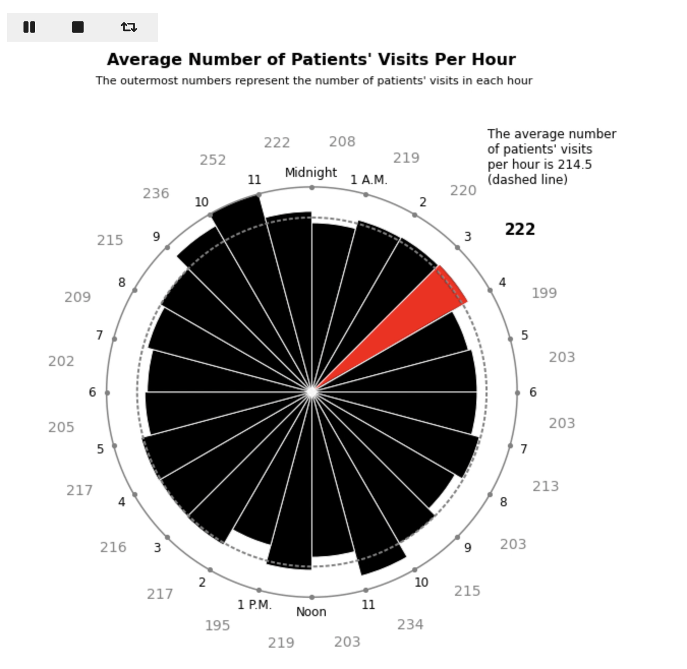
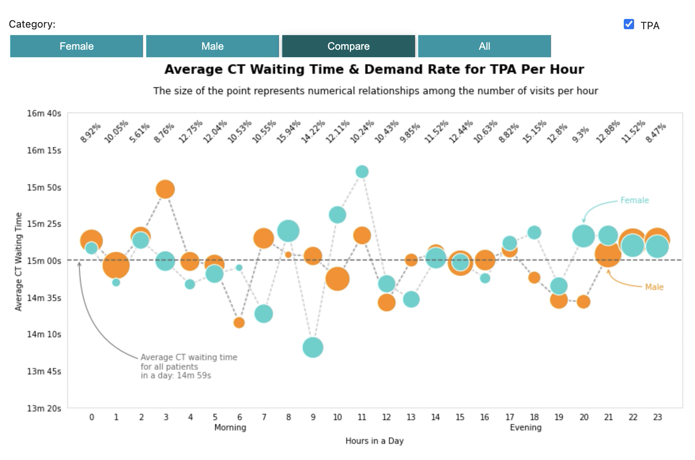
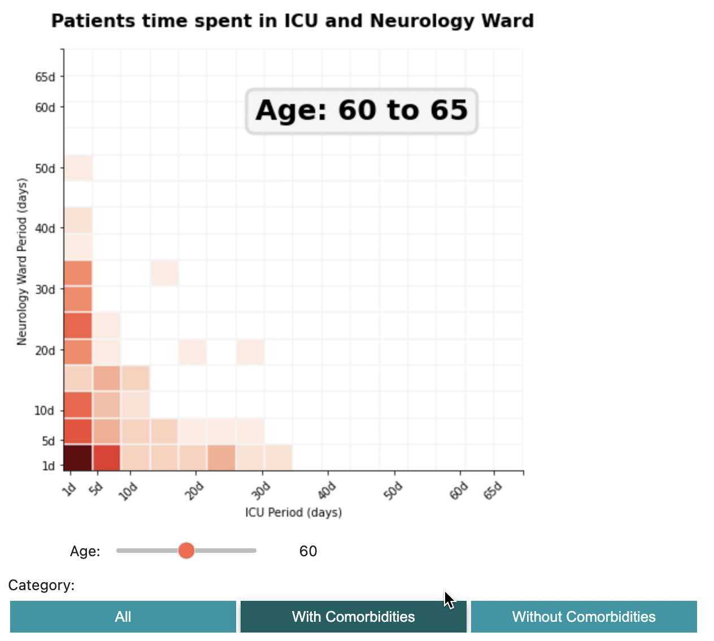
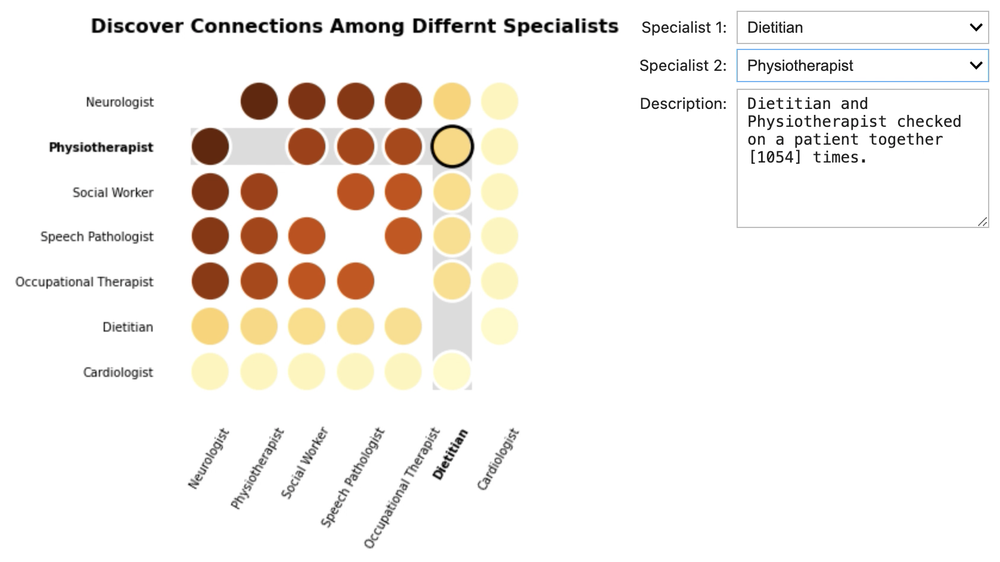

# Data Visualization - Interactive Dashboard

## Description
Interactive dashboard can help customers to explore the data and understand underlying processes and trends by using interactive elements.

> In this project, I designed four interactive visualizations to better monitor the hospital’s processes around stroke care.

We design the dashboard in accordance with the patient's journey through the hospital system, from the time they arrive in the emergency department to the time they are discharged.

## Interactive Dashboard

### 1. Patients arrive to hospital in the emergency department.

> We focus on the average number of patients' visits per hour in a day, allowing the hospital to prepare in advance. We use a polar chart the demonstrate the trends in a dial plate.

### 2. Patients undergo a CT scan to diagnose the stroke, followed by TPA to break up the blood clot.

> We analyze the average CT waiting time per hour for different patient groups to verify whether patients got a timely diagnosis.

### 3. Some patients may spend some time in the ICU.

> We target the correlations between the time spent in the ICU and the neurology ward using a heatmap. The darker the color, the more patients there are.

### 4. Patients are transferred to the neurology ward, where they are seen by a variety of medical specialists.

> We are interested in connections among patients visited by different medical specialists.

- The color of the points corresponds to the number of times both specialists have visited the patient. The darker the color, the more concurrence there is.

- We use the textarea as an output displayer. Textarea is updated when triggered by dropdown menus. It shows the number of times two selected specialists checked on a patient together.
